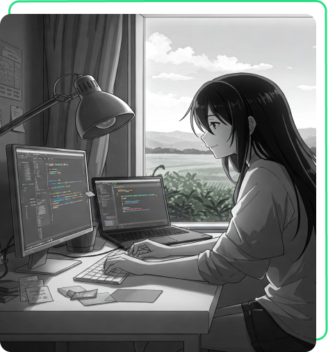

Este README foi estruturado para:
1. Demonstrar organização técnica;
2. Destacar competências front-end;
3. Mostrar conhecimento em boas práticas;
4. Facilitar a avaliação do código;
5. Contextualizar as escolhas técnicas.
# Portfólio Front-end - Cauan Henrique
## ✨ Funcionalidades Principais

- Design responsivo para diferentes telas
- Navegação entre múltrias páginas (Home, Sobre Mim, Currículo)
- Sistema de cores variáveis com CSS Custom Properties
- Efeitos hover interativos
- Tipografia consistente com Google Fonts
- Layout flexível usando Flexbox
- Links para redes sociais integrados

## 🖥️ Demonstração

[](https://curriculo-orpin-six.vercel.app/)

## 🔍 Destaques Técnicos

### HTML
- Semântica HTML5 moderna;
- Estrutura de navegação acessível;
- Meta tags para responsividade;
- Organização BEM para classes CSS.

### CSS
```css
/* Sistema de cores com variáveis */
:root {
    --cor-primaria: black;
    --cor-terciaria: #24df84;
    --fonte-primaria: "Krona One", sans-serif;
}

/* Media Queries integradas */
.cabecalho__menu {
    gap: 80px; /* Espaçamento responsivo */
}

/* Efeitos hover dinâmicos */
.apresentacao__links__link__github:hover {
    background-color: var(--cor-hover);
}
```

## 🚀 Como Executar

- Clone o repositório e abra o arquivo principal;

OU

- [](https://curriculo-orpin-six.vercel.app/)

## Tecnologias Utilizadas 💡


## 📌 Aprendizados

- Implementação de temas com variáveis CSS;

- Técnicas avançadas de posicionamento;

- Organização de código escalável;

- Princípios de design responsivo;

- Otimização de elementos gráficos.

## 🤝Créditos

Ícones por: Flat Icon

Tipografia por: Google Fonts


Desenvolvido com ❤️ por Cauan Henrique
